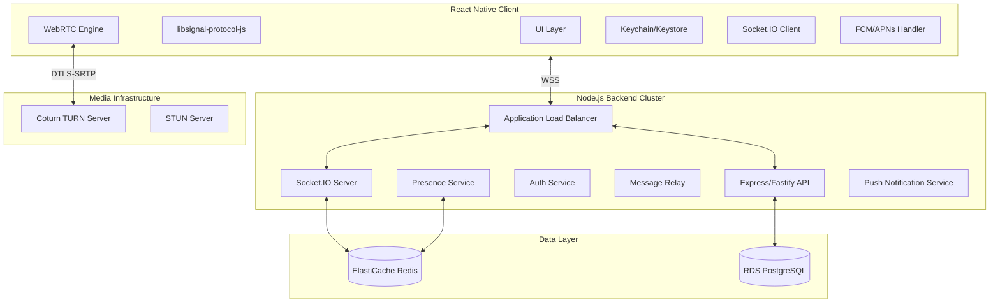
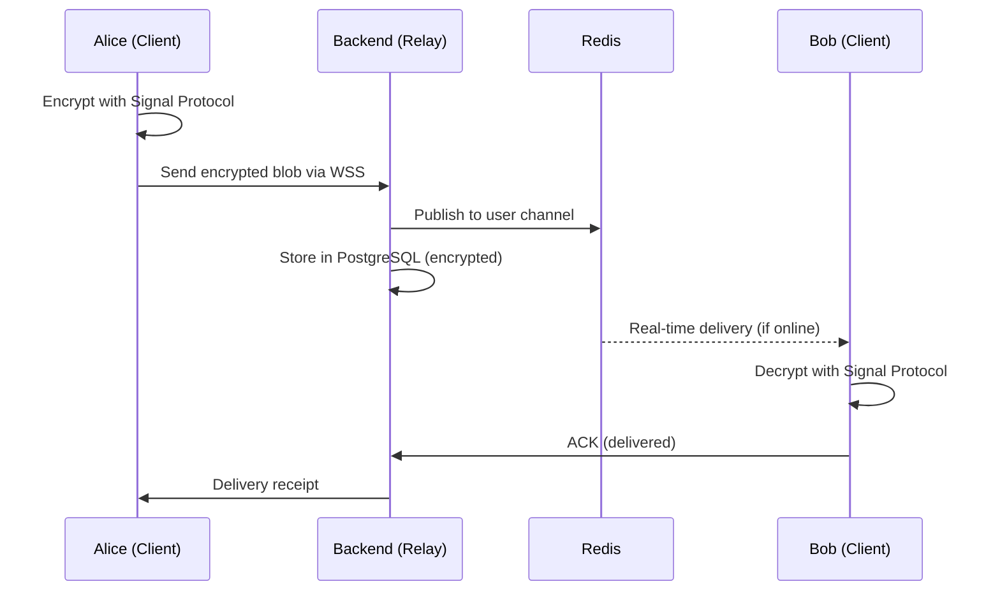

# Production-Ready Architecture Review
## WhatsApp-Like Communication App - Security & Hardening Guide

---

# 1. Final Refined Architecture

## 1.1 High-Level System Diagram



## 1.2 Module Responsibilities

| Module | Responsibility | Security Boundary |
|--------|---------------|-------------------|
| **Auth Service** | JWT issuance, refresh tokens, device registration | Validates all identity claims |
| **Message Relay** | Stores/forwards encrypted blobs only | Zero-knowledge of plaintext |
| **Presence Service** | Online/offline/typing state via Redis | Rate-limited, ephemeral |
| **Push Service** | Sends generic notifications | No message content in payload |
| **TURN Server** | Media relay for NAT traversal | Authenticated, time-limited credentials |

## 1.3 Data Flow - Text Message



## 1.4 Data Flow - Voice/Video Call

```mermaid
sequenceDiagram
    participant A as Caller
    participant S as Signaling Server
    participant T as TURN Server
    participant B as Callee
    
    A->>S: Call initiation (encrypted SDP)
    S->>B: Push notification + signaling
    B->>S: Accept + encrypted SDP answer
    S->>A: Forward answer
    A->>T: Request TURN credentials
    T->>A: Time-limited credentials
    A<-->B: Direct P2P (DTLS-SRTP) or via TURN
    Note over A,B: Media encrypted end-to-end
```

---

# 2. Client-Side Hardening Recommendations

## 2.1 Key Management

> [!CAUTION]
> **Identity keys must NEVER leave secure enclave.** Use Keychain (iOS) and Keystore (Android) with hardware-backed keys when available.

```typescript
// Key storage abstraction
interface SecureKeyStore {
  generateIdentityKeyPair(): Promise<KeyPair>;
  storePreKeys(preKeys: PreKey[]): Promise<void>;
  getIdentityKey(): Promise<PrivateKey>; // Never export raw bytes
  signWithIdentityKey(data: Uint8Array): Promise<Signature>;
}
```

**Requirements:**
- Generate identity keys on device during registration
- Store Signal protocol keys in Keychain/Keystore only
- Use biometric authentication for key access on sensitive operations
- Implement key rotation every 30 days for signed pre-keys
- Generate 100 one-time pre-keys, replenish when < 20 remain

## 2.2 Session Handling

```typescript
interface SessionConfig {
  accessTokenTTL: 15 * 60 * 1000;      // 15 minutes
  refreshTokenTTL: 7 * 24 * 60 * 60 * 1000; // 7 days
  maxConcurrentSessions: 1;            // Single device for beta
  sessionBindingEnabled: true;          // Bind to device fingerprint
}
```

**Session Security:**
- Bind sessions to device fingerprint (vendor ID + app installation ID)
- Store refresh tokens in Keychain/Keystore only
- Implement silent token refresh 2 minutes before expiry
- Clear all credentials on logout
- Detect and invalidate sessions on suspected compromise

## 2.3 Reconnection Logic

```typescript
class ReconnectionManager {
  private backoffMs = [1000, 2000, 4000, 8000, 16000, 30000];
  private maxRetries = 10;
  private jitterFactor = 0.3;
  
  async reconnect(): Promise<void> {
    for (let i = 0; i < this.maxRetries; i++) {
      const delay = this.backoffMs[Math.min(i, this.backoffMs.length - 1)];
      const jitter = delay * this.jitterFactor * Math.random();
      await sleep(delay + jitter);
      
      if (await this.attemptConnection()) {
        await this.syncMissedMessages();
        return;
      }
    }
    this.notifyUserConnectionFailed();
  }
}
```

**Reconnection Requirements:**
- Exponential backoff with jitter (prevent thundering herd)
- Queue outgoing messages during disconnection
- Sync missed messages on reconnect using last-received timestamp
- Show connection status indicator to user
- Handle app backgrounding gracefully (iOS/Android lifecycle)

## 2.4 Local Data Security

| Data Type | Storage | Encryption |
|-----------|---------|------------|
| Identity Keys | Keychain/Keystore | Hardware-backed |
| Session Keys | Keychain/Keystore | Hardware-backed |
| Messages | MMKV | AES-256-GCM with DEK |
| User Preferences | AsyncStorage | None (non-sensitive) |
| Media Cache | File System | AES-256-GCM |

**Data Encryption Key (DEK) Management:**
```typescript
// DEK wrapped by KEK stored in Keychain/Keystore
interface DataEncryption {
  kek: SecureKeyRef;  // Key Encryption Key in secure enclave
  dek: Uint8Array;    // Data Encryption Key (encrypted at rest)
  
  async getDEK(): Promise<Uint8Array> {
    return await unwrapWithKEK(this.dek, this.kek);
  }
}
```

## 2.5 Certificate Pinning

```typescript
// Network security configuration
const pinnedCerts = {
  'api.yourapp.com': [
    'sha256/AAAAAAAAAAAAAAAAAAAAAAAAAAAAAAAAAAAAAAAAAAA=', // Primary
    'sha256/BBBBBBBBBBBBBBBBBBBBBBBBBBBBBBBBBBBBBBBBBBB=', // Backup
  ],
  'turn.yourapp.com': [
    'sha256/CCCCCCCCCCCCCCCCCCCCCCCCCCCCCCCCCCCCCCCCCCC=',
  ],
};
```

> [!IMPORTANT]
> Always pin to intermediate CA certificates, not leaf certificates. Include backup pins for rotation.

---

# 3. Backend Hardening Recommendations

## 3.1 Zero-Trust Architecture

```typescript
// Message relay - backend sees ONLY encrypted blobs
interface EncryptedMessage {
  id: string;
  senderId: string;
  recipientId: string;
  encryptedPayload: string;  // Base64 encoded ciphertext
  timestamp: number;
  // NO plaintext content ever
}

// Backend validation
function validateMessage(msg: EncryptedMessage): boolean {
  // Validate structure, NOT content
  return (
    isValidUUID(msg.id) &&
    isValidUserId(msg.senderId) &&
    isValidUserId(msg.recipientId) &&
    isBase64(msg.encryptedPayload) &&
    msg.encryptedPayload.length <= MAX_PAYLOAD_SIZE
  );
}
```

## 3.2 Authentication & Authorization

```typescript
// JWT structure
interface JWTPayload {
  sub: string;           // User ID
  did: string;           // Device ID
  iat: number;           // Issued at
  exp: number;           // Expiry (15 min)
  jti: string;           // Unique token ID (for revocation)
  aud: 'chat-api';       // Audience
  iss: 'auth-service';   // Issuer
}

// Middleware chain
app.use('/api/*', [
  rateLimiter,
  validateJWT,
  checkTokenRevocation,
  validateDeviceBinding,
  requestLogger,
]);
```

**Auth Requirements:**
- Use RS256 (asymmetric) for JWT signing
- Implement token revocation via Redis blacklist
- Rate limit auth endpoints: 5 attempts/minute
- Require device re-registration after password change
- Log all auth events for security audit

## 3.3 Rate Limiting Strategy

| Endpoint | Limit | Window | Action on Exceed |
|----------|-------|--------|------------------|
| `/auth/login` | 5 | 1 min | Block 15 min |
| `/auth/register` | 3 | 1 hour | Block 24 hours |
| `/messages/send` | 60 | 1 min | Queue delay |
| `/presence/update` | 10 | 1 min | Ignore |
| WebSocket events | 100 | 1 min | Disconnect |

```typescript
// Redis-based distributed rate limiter
const rateLimiter = rateLimit({
  store: new RedisStore({ client: redis }),
  windowMs: 60 * 1000,
  max: 60,
  keyGenerator: (req) => `${req.user.id}:${req.path}`,
  handler: (req, res) => {
    res.status(429).json({ error: 'Rate limit exceeded', retryAfter: 60 });
  },
});
```

## 3.4 Database Schema Hardening

```sql
-- Users table
CREATE TABLE users (
    id UUID PRIMARY KEY DEFAULT gen_random_uuid(),
    phone_hash VARCHAR(64) NOT NULL UNIQUE, -- SHA-256 of phone
    identity_key_public BYTEA NOT NULL,
    signed_prekey_public BYTEA NOT NULL,
    signed_prekey_signature BYTEA NOT NULL,
    registration_id INTEGER NOT NULL,
    created_at TIMESTAMPTZ DEFAULT NOW(),
    updated_at TIMESTAMPTZ DEFAULT NOW()
);

-- Messages table (encrypted blobs only)
CREATE TABLE messages (
    id UUID PRIMARY KEY DEFAULT gen_random_uuid(),
    sender_id UUID REFERENCES users(id),
    recipient_id UUID REFERENCES users(id),
    encrypted_payload BYTEA NOT NULL,
    delivered_at TIMESTAMPTZ,
    read_at TIMESTAMPTZ,
    created_at TIMESTAMPTZ DEFAULT NOW(),
    expires_at TIMESTAMPTZ DEFAULT NOW() + INTERVAL '30 days'
);

-- Indexes
CREATE INDEX idx_messages_recipient_undelivered 
    ON messages(recipient_id, created_at) 
    WHERE delivered_at IS NULL;

-- Row-level security
ALTER TABLE messages ENABLE ROW LEVEL SECURITY;

CREATE POLICY messages_access ON messages
    USING (sender_id = current_user_id() OR recipient_id = current_user_id());
```

## 3.5 Socket.IO Scaling with Redis

```typescript
import { createAdapter } from '@socket.io/redis-adapter';
import { createClient } from 'redis';

// Redis cluster for Socket.IO adapter
const pubClient = createClient({ url: process.env.REDIS_URL });
const subClient = pubClient.duplicate();

io.adapter(createAdapter(pubClient, subClient));

// Room management for user sessions
io.on('connection', (socket) => {
  const userId = socket.handshake.auth.userId;
  socket.join(`user:${userId}`);
  
  // Presence update
  redis.hset('presence', userId, JSON.stringify({
    status: 'online',
    lastSeen: Date.now(),
    socketId: socket.id,
  }));
});
```

## 3.6 Presence Service Design

```typescript
interface PresenceManager {
  // Heartbeat every 30 seconds
  heartbeatInterval: 30000;
  
  // Consider offline after 2 missed heartbeats
  offlineThreshold: 70000;
  
  async updatePresence(userId: string, status: 'online' | 'typing'): Promise<void> {
    await redis.hset(`presence:${userId}`, {
      status,
      lastSeen: Date.now(),
    });
    await redis.expire(`presence:${userId}`, 120);
    
    // Notify subscribers
    await redis.publish(`presence:updates`, JSON.stringify({ userId, status }));
  }
  
  async getPresence(userId: string): Promise<PresenceStatus> {
    const data = await redis.hgetall(`presence:${userId}`);
    if (!data || Date.now() - data.lastSeen > this.offlineThreshold) {
      return { status: 'offline', lastSeen: data?.lastSeen };
    }
    return data;
  }
}
```

---

# 4. WebRTC Reliability & TURN Best Practices

## 4.1 ICE Configuration

```typescript
const iceConfig: RTCConfiguration = {
  iceServers: [
    // STUN (free, for direct P2P)
    { urls: 'stun:stun.l.google.com:19302' },
    { urls: 'stun:stun.yourapp.com:3478' },
    
    // TURN (authenticated, for relay)
    {
      urls: [
        'turn:turn.yourapp.com:3478?transport=udp',
        'turn:turn.yourapp.com:3478?transport=tcp',
        'turns:turn.yourapp.com:443?transport=tcp', // TLS for firewalls
      ],
      username: 'DYNAMIC_FROM_SERVER',
      credential: 'TIME_LIMITED_TOKEN',
    },
  ],
  iceTransportPolicy: 'all', // Use 'relay' only for testing
  bundlePolicy: 'max-bundle',
  rtcpMuxPolicy: 'require',
};
```

## 4.2 TURN Credential Management

```typescript
// Server-side TURN credential generation
function generateTurnCredentials(userId: string): TurnCredentials {
  const ttl = 86400; // 24 hours
  const timestamp = Math.floor(Date.now() / 1000) + ttl;
  const username = `${timestamp}:${userId}`;
  const credential = crypto
    .createHmac('sha1', TURN_SECRET)
    .update(username)
    .digest('base64');
  
  return {
    username,
    credential,
    ttl,
    urls: TURN_URLS,
  };
}
```

> [!WARNING]
> Never hardcode TURN credentials. Always generate time-limited credentials server-side.

## 4.3 Coturn Server Configuration

```bash
# /etc/turnserver.conf
listening-port=3478
tls-listening-port=443
listening-ip=0.0.0.0
relay-ip=PRIVATE_IP
external-ip=PUBLIC_IP/PRIVATE_IP

# Authentication
use-auth-secret
static-auth-secret=YOUR_STRONG_SECRET_HERE
realm=turn.yourapp.com

# Security
no-tcp-relay
denied-peer-ip=10.0.0.0-10.255.255.255
denied-peer-ip=172.16.0.0-172.31.255.255
denied-peer-ip=192.168.0.0-192.168.255.255

# Performance
min-port=49152
max-port=65535
total-quota=100
user-quota=10
max-bps=1000000

# TLS
cert=/etc/letsencrypt/live/turn.yourapp.com/fullchain.pem
pkey=/etc/letsencrypt/live/turn.yourapp.com/privkey.pem
cipher-list="ECDHE-RSA-AES256-GCM-SHA384:ECDHE-RSA-AES128-GCM-SHA256"

# Logging
log-file=/var/log/turnserver.log
verbose
```

## 4.4 Call Signaling Reliability

```typescript
class CallSignaling {
  private pendingCalls = new Map<string, CallState>();
  
  async initiateCall(calleeId: string): Promise<CallSession> {
    const callId = uuid();
    const offer = await this.peerConnection.createOffer();
    await this.peerConnection.setLocalDescription(offer);
    
    // Send via WebSocket
    this.socket.emit('call:offer', {
      callId,
      calleeId,
      sdp: offer.sdp,
      type: 'offer',
    });
    
    // Also send push notification as backup
    await this.sendCallPush(calleeId, callId);
    
    // Set timeout for answer
    return new Promise((resolve, reject) => {
      const timeout = setTimeout(() => {
        this.pendingCalls.delete(callId);
        reject(new Error('Call timeout - no answer'));
      }, 60000);
      
      this.pendingCalls.set(callId, { resolve, reject, timeout });
    });
  }
  
  // Handle ICE candidates
  onIceCandidate(candidate: RTCIceCandidate) {
    // Trickle ICE - send candidates as they're discovered
    this.socket.emit('call:ice-candidate', {
      callId: this.currentCallId,
      candidate: candidate.toJSON(),
    });
  }
}
```

## 4.5 Call Quality Monitoring

```typescript
interface CallQualityMetrics {
  packetsLost: number;
  jitter: number;
  roundTripTime: number;
  bitrate: number;
}

async function monitorCallQuality(pc: RTCPeerConnection): Promise<void> {
  setInterval(async () => {
    const stats = await pc.getStats();
    stats.forEach((report) => {
      if (report.type === 'inbound-rtp' && report.kind === 'audio') {
        const metrics: CallQualityMetrics = {
          packetsLost: report.packetsLost,
          jitter: report.jitter,
          roundTripTime: report.roundTripTime,
          bitrate: report.bytesReceived / report.timestamp,
        };
        
        // Adaptive quality
        if (metrics.packetsLost > 5 || metrics.jitter > 50) {
          reduceBitrate();
        }
      }
    });
  }, 1000);
}
```

---

# 5. Security Checklist for Beta Launch

## 5.1 Cryptography

- [ ] Signal Protocol properly initialized with identity keys
- [ ] Pre-keys generated and uploaded on registration
- [ ] Double Ratchet advancing after each message
- [ ] DTLS-SRTP enabled for all WebRTC connections
- [ ] No plaintext ever transmitted or stored server-side
- [ ] AES-256-GCM for local database encryption
- [ ] HKDF for key derivation

## 5.2 Authentication & Sessions

- [ ] JWT tokens using RS256 (not HS256)
- [ ] Access tokens expire in 15 minutes
- [ ] Refresh tokens bound to device fingerprint
- [ ] Token revocation implemented (Redis blacklist)
- [ ] Failed login attempt limiting
- [ ] Password hashed with Argon2id

## 5.3 Network Security

- [ ] TLS 1.3 enforced on all endpoints
- [ ] Certificate pinning implemented
- [ ] HSTS headers enabled
- [ ] No mixed content
- [ ] WebSocket connections authenticated
- [ ] TURN credentials time-limited

## 5.4 Input Validation

- [ ] All inputs validated server-side
- [ ] Payload size limits enforced
- [ ] SQL injection prevention (parameterized queries)
- [ ] XSS prevention (output encoding)
- [ ] Rate limiting on all endpoints

## 5.5 Privacy

- [ ] Phone numbers stored as hashes only
- [ ] Push notifications contain no message content
- [ ] Minimal logging (no message content)
- [ ] Data retention policy enforced (30-day auto-delete)
- [ ] User data export endpoint (GDPR)
- [ ] Account deletion fully removes data

## 5.6 Infrastructure

- [ ] Security groups restrict unnecessary access
- [ ] RDS not publicly accessible
- [ ] Redis authentication enabled
- [ ] Secrets in AWS Secrets Manager (not env files)
- [ ] CloudWatch alerts for anomalies
- [ ] Regular security patches applied

---

# 6. App Store & Play Store Compliance

## 6.1 Apple App Store Requirements

| Requirement | Implementation |
|-------------|----------------|
| **App Tracking Transparency** | Not required (no tracking) |
| **Privacy Nutrition Label** | Declare: Phone number (contact), Device ID (analytics), Usage Data |
| **Data Encryption** | Document Signal Protocol + local encryption |
| **PushKit for VoIP** | Required for call notifications on iOS |
| **CallKit Integration** | Required for native call UI on iOS |
| **Background Modes** | Enable: Audio, VoIP, Background fetch |

```xml
<!-- Info.plist -->
<key>UIBackgroundModes</key>
<array>
    <string>audio</string>
    <string>voip</string>
    <string>remote-notification</string>
</array>

<key>NSMicrophoneUsageDescription</key>
<string>Required for voice and video calls</string>

<key>NSCameraUsageDescription</key>
<string>Required for video calls</string>
```

## 6.2 Google Play Store Requirements

| Requirement | Implementation |
|-------------|----------------|
| **Data Safety Form** | Declare: Phone number, Device ID, Messages (E2EE noted) |
| **Permissions Declaration** | Justify: CAMERA, MICROPHONE, PHONE_STATE, READ_CONTACTS |
| **Target SDK** | Must be Android 14 (API 34) minimum |
| **Background Restrictions** | Use WorkManager for background sync |
| **Battery Optimization** | Request exemption for calls only |

```xml
<!-- AndroidManifest.xml -->
<uses-permission android:name="android.permission.CAMERA" />
<uses-permission android:name="android.permission.RECORD_AUDIO" />
<uses-permission android:name="android.permission.READ_PHONE_STATE" />
<uses-permission android:name="android.permission.FOREGROUND_SERVICE" />
<uses-permission android:name="android.permission.POST_NOTIFICATIONS" />

<!-- Required for call notifications -->
<uses-permission android:name="android.permission.USE_FULL_SCREEN_INTENT" />
```

## 6.3 Privacy Policy Requirements

Must include:
- What data is collected (phone number, device ID)
- How E2EE works (Signal Protocol explanation)
- That server cannot read messages
- Data retention policy
- How to request data deletion
- Contact information for privacy inquiries

---

# 7. Common Pitfalls and How to Avoid Them

## 7.1 Signal Protocol Pitfalls

| Pitfall | Solution |
|---------|----------|
| Not handling out-of-order messages | Implement Double Ratchet correctly with message keys cache |
| Pre-key exhaustion | Monitor pre-key count, replenish at 20 remaining |
| Session corruption on reinstall | Notify contacts of identity key change |
| Storing keys in AsyncStorage | Use ONLY Keychain/Keystore for cryptographic keys |

## 7.2 WebRTC Pitfalls

| Pitfall | Solution |
|---------|----------|
| ICE candidates arriving before remote description | Queue candidates, apply after setRemoteDescription |
| TURN credentials expiring mid-call | Generate fresh credentials before each call |
| Call drops on network switch | Implement ICE restart on network change |
| Echo during calls | Enable echo cancellation in audio constraints |

```typescript
// Correct ICE handling
let pendingCandidates: RTCIceCandidate[] = [];

async function handleOffer(offer: RTCSessionDescriptionInit) {
  await pc.setRemoteDescription(offer);
  
  // Now apply any queued candidates
  for (const candidate of pendingCandidates) {
    await pc.addIceCandidate(candidate);
  }
  pendingCandidates = [];
}

function handleCandidate(candidate: RTCIceCandidateInit) {
  if (pc.remoteDescription) {
    pc.addIceCandidate(candidate);
  } else {
    pendingCandidates.push(new RTCIceCandidate(candidate));
  }
}
```

## 7.3 Socket.IO Pitfalls

| Pitfall | Solution |
|---------|----------|
| Message loss on disconnect | Queue messages, sync on reconnect with last timestamp |
| Thundering herd on reconnect | Exponential backoff with jitter |
| Memory leaks from event listeners | Clean up listeners on disconnect |
| Authentication bypass | Validate JWT on every connection and reconnection |

## 7.4 iOS-Specific Pitfalls

| Pitfall | Solution |
|---------|----------|
| App suspended, calls missed | Use PushKit for VoIP, not regular APNs |
| CallKit not showing | Report call to CallKit BEFORE processing |
| Audio routing issues | Use AVAudioSession correctly |
| Background task killed | Use beginBackgroundTask for cleanup |

## 7.5 Android-Specific Pitfalls

| Pitfall | Solution |
|---------|----------|
| Notifications blocked | Request POST_NOTIFICATIONS permission (Android 13+) |
| Service killed in background | Use foreground service for active calls |
| Doze mode blocking | Request battery optimization exemption |
| Keystore key invalidated | Handle UserNotAuthenticatedException |

## 7.6 Production Operations Pitfalls

| Pitfall | Solution |
|---------|----------|
| Secrets in git | Use AWS Secrets Manager, rotate on exposure |
| No alerting | CloudWatch alarms for error rates, latency |
| Database connection exhaustion | Connection pooling, proper limits |
| Redis single point of failure | Use ElastiCache with Multi-AZ |
| No graceful degradation | Feature flags for non-critical features |

---

# 8. Essential Missing Features for Beta

The following are commonly expected features that should be included:

## 8.1 Must-Have for Beta

1. **Message Retry Queue** - Automatic retry for failed message sends
2. **Offline Message Sync** - Fetch missed messages on reconnect
3. **Read Receipts** - Double checkmarks for delivered/read
4. **Call Reconnection** - Automatic reconnect on brief network drops
5. **Session Verification** - QR code or safety number comparison  
6. **Profile Management** - Name, avatar with E2EE
7. **Block/Report Users** - Basic abuse prevention
8. **Network Status Indicator** - Clear connection state to user
9. **Audio Routing** - Speaker/earpiece toggle during calls

## 8.2 Recommended Observability

```typescript
// Key metrics to track
interface AppMetrics {
  // Message delivery
  messagesSent: Counter;
  messagesDelivered: Counter;
  messageDeliveryLatency: Histogram;
  
  // Calls
  callsInitiated: Counter;
  callsConnected: Counter;
  callDuration: Histogram;
  callQuality: Gauge;
  
  // Errors
  signalProtocolErrors: Counter;
  webrtcErrors: Counter;
  socketReconnections: Counter;
}
```

---

# Summary

This document provides a production-ready enhancement of the agreed architecture. Key improvements include:

1. **Zero-trust backend** - Server never sees plaintext
2. **Proper key lifecycle** - Hardware-backed storage, rotation policies
3. **Robust reconnection** - Exponential backoff, message queuing, sync
4. **TURN hardening** - Time-limited credentials, proper configuration
5. **Rate limiting** - Distributed, per-endpoint policies
6. **Platform compliance** - iOS/Android specific requirements addressed
7. **Security checklist** - Comprehensive pre-launch verification

The architecture maintains all agreed stack choices while adding the hardening necessary for real-world beta usage.
