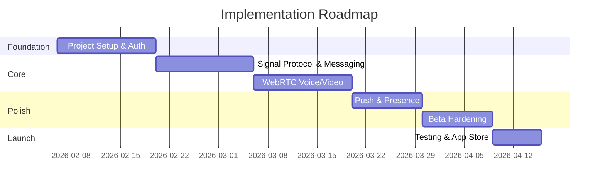
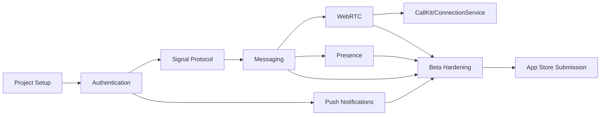

# Implementation Roadmap
## WhatsApp-Like Chat App - Beta Release

---

## Timeline Overview

---

## Sprint 1: Foundation (Week 1-2)

### 1.1 Project Setup
| Task | Owner | Duration |
|------|-------|----------|
| Initialize React Native project (bare workflow) | Client | 1 day |
| Setup TypeScript, ESLint, Prettier | Client | 0.5 day |
| Initialize Node.js backend with Fastify | Backend | 1 day |
| Setup PostgreSQL schema + migrations | Backend | 1 day |
| Configure Redis for sessions/presence | Backend | 0.5 day |
| Setup AWS infrastructure (ECS, RDS, ElastiCache) | DevOps | 2 days |

### 1.2 Authentication
| Task | Owner | Duration |
|------|-------|----------|
| Phone OTP flow (Twilio/Firebase) | Full Stack | 2 days |
| JWT auth with RS256 signing | Backend | 1 day |
| Refresh token rotation | Backend | 1 day |
| Device registration + binding | Full Stack | 1 day |
| Secure token storage (Keychain/Keystore) | Client | 1 day |

**Sprint 1 Deliverable:** Users can register, login, and maintain authenticated sessions.

---

## Sprint 2: Encryption & Messaging (Week 3-4)

### 2.1 Signal Protocol Setup
| Task | Owner | Duration |
|------|-------|----------|
| Integrate libsignal-protocol-javascript | Client | 2 days |
| Identity key generation + secure storage | Client | 2 days |
| Pre-key bundle generation (100 keys) | Client | 1 day |
| Pre-key upload to server | Full Stack | 1 day |
| Session establishment (X3DH) | Client | 2 days |

### 2.2 Messaging Flow
| Task | Owner | Duration |
|------|-------|----------|
| Socket.IO connection with auth | Full Stack | 1 day |
| Message encryption (Double Ratchet) | Client | 2 days |
| Message relay (zero-knowledge backend) | Backend | 1 day |
| Delivery receipts | Full Stack | 1 day |
| Read receipts | Full Stack | 0.5 day |
| Offline message queue + sync | Full Stack | 2 days |

**Sprint 2 Deliverable:** Users can exchange E2E encrypted messages with delivery/read receipts.

---

## Sprint 3: Voice & Video Calls (Week 5-6)

### 3.1 WebRTC Setup
| Task | Owner | Duration |
|------|-------|----------|
| WebRTC peer connection setup | Client | 2 days |
| ICE candidate handling (trickle ICE) | Client | 1 day |
| TURN server deployment (Coturn) | DevOps | 1 day |
| Time-limited TURN credential generation | Backend | 1 day |

### 3.2 Call Signaling
| Task | Owner | Duration |
|------|-------|----------|
| Call initiation flow (offer/answer) | Full Stack | 2 days |
| Call accept/reject/busy handling | Full Stack | 1 day |
| ICE restart on network change | Client | 1 day |
| Call quality monitoring | Client | 1 day |
| Audio routing (speaker/earpiece) | Client | 1 day |

### 3.3 Platform Integration
| Task | Owner | Duration |
|------|-------|----------|
| CallKit integration (iOS) | Client | 2 days |
| ConnectionService integration (Android) | Client | 2 days |

**Sprint 3 Deliverable:** Users can make/receive E2E encrypted voice and video calls.

---

## Sprint 4: Push Notifications & Presence (Week 7-8)

### 4.1 Push Notifications
| Task | Owner | Duration |
|------|-------|----------|
| FCM setup (Android) | Full Stack | 1 day |
| APNs setup (iOS) | Full Stack | 1 day |
| PushKit for VoIP calls (iOS) | Client | 2 days |
| Generic notification content (no plaintext) | Backend | 0.5 day |
| Notification tap handling | Client | 1 day |

### 4.2 Presence System
| Task | Owner | Duration |
|------|-------|----------|
| Online/offline status with Redis | Backend | 1 day |
| Heartbeat mechanism | Full Stack | 1 day |
| Typing indicators | Full Stack | 1 day |
| Last seen timestamps | Full Stack | 0.5 day |

**Sprint 4 Deliverable:** Push notifications work, presence indicators show correctly.

---

## Sprint 5: Beta Hardening (Week 9-10)

### 5.1 Security Hardening
| Task | Owner | Duration |
|------|-------|----------|
| Certificate pinning | Client | 1 day |
| Rate limiting all endpoints | Backend | 1 day |
| Input validation audit | Backend | 1 day |
| Security logging + CloudWatch alerts | Backend | 1 day |

### 5.2 Reliability
| Task | Owner | Duration |
|------|-------|----------|
| Reconnection with exponential backoff | Client | 1 day |
| Message retry queue | Client | 1 day |
| Graceful shutdown handling | Backend | 0.5 day |
| Circuit breaker for Redis/DB | Backend | 1 day |

### 5.3 UX Polish
| Task | Owner | Duration |
|------|-------|----------|
| Network status indicator | Client | 0.5 day |
| Safety number verification UI | Client | 1 day |
| Block/report user flow | Full Stack | 1 day |
| Profile management (name/avatar) | Full Stack | 1 day |

**Sprint 5 Deliverable:** Production-ready, hardened application.

---

## Sprint 6: Testing & Launch (Week 11)

### 6.1 Testing
| Task | Owner | Duration |
|------|-------|----------|
| E2E encryption verification tests | QA | 2 days |
| Call quality testing (various networks) | QA | 1 day |
| Load testing (Socket.IO, TURN) | DevOps | 1 day |
| Security penetration testing | Security | 2 days |

### 6.2 App Store Submission
| Task | Owner | Duration |
|------|-------|----------|
| App Store Connect setup | Client | 0.5 day |
| Play Console setup | Client | 0.5 day |
| Privacy policy + data safety forms | Legal | 1 day |
| Screenshot + metadata | Design | 1 day |
| Submit for review | Client | 1 day |

**Sprint 6 Deliverable:** App submitted to both stores, beta ready.

---

## Dependencies Graph

---

## Risk Mitigation

| Risk | Mitigation |
|------|------------|
| Signal Protocol integration complexity | Start early, allocate buffer time |
| iOS CallKit/PushKit edge cases | Test on physical devices early |
| TURN server bandwidth costs | Monitor usage, set quotas |
| App Store rejection | Follow guidelines strictly, prepare appeal |
