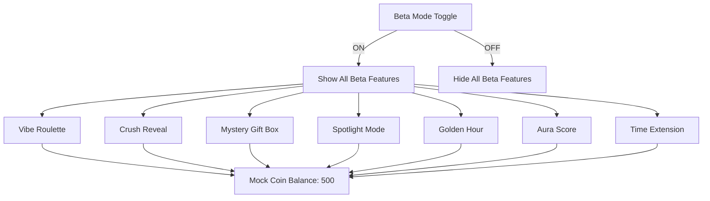

# Beta Mode Monetization Features - Implementation Plan

## Overview
Implement 7 high-impact, demo-only monetization features that activate only when **Beta Mode** is toggled ON. All features use mock data and fake logic for client demo purposes.

---

## User Review Required

> [!IMPORTANT]
> **All features are DEMO-ONLY** - No real payments, backend, or encryption. Perfect for investor/client presentations.

---

## Proposed Changes

### Core Infrastructure

#### [NEW] [beta-features.css](file:///media/swastik/focus/chat%20app/php-social-messenger/public/css/beta-features.css)
- Beta Mode toggle styling
- Hidden state classes for features when Beta Mode is OFF
- Animations for all 7 features (spinning, glowing, shaking, etc.)
- Modal overlays and coin displays
- Rarity colors (common, rare, epic, legendary)

#### [NEW] [beta-features.js](file:///media/swastik/focus/chat%20app/php-social-messenger/public/js/beta-features.js)
- `BetaMode` controller with localStorage persistence
- Feature visibility toggle based on Beta Mode state
- All 7 feature implementations with mock logic

---

### Feature Implementations

| # | Feature | Demo Behavior | Revenue Display |
|---|---------|---------------|-----------------|
| 1 | **Vibe Roulette** 🎰 | Spin wheel → Match animation → "VIP Match!" | 15 coins/spin |
| 2 | **Crush Reveal** 💕 | Blurred faces → Unlock one-by-one | 20-50 coins/reveal |
| 3 | **Mystery Gift Box** 🎁 | Box shake → Open → Random rarity gift | 30 coins/box |
| 4 | **Spotlight Mode** ⭐ | Profile glows gold → 30min timer | 50 coins/30min |
| 5 | **Golden Hour** ⏰ | 2x banner → Countdown → Bonus effects | +50% gift sales |
| 6 | **Aura Score** ✨ | Meter display → Glow animation → Boost option | 100 coins/boost |
| 7 | **Time Extension** ⏳ | 5min timer → Warning → Extend modal | 10 coins/5min |

---

### UI Integration

#### [MODIFY] [header.php](file:///media/swastik/focus/chat%20app/php-social-messenger/views/partials/header.php)
- Add Beta Mode toggle (purple/neon switch)
- Include `beta-features.css` and `beta-features.js`

#### [MODIFY] [index.php (contacts)](file:///media/swastik/focus/chat%20app/php-social-messenger/views/chat/index.php)
- Add Vibe Roulette button (visible only in Beta Mode)
- Add Crush Reveal notification badge
- Add Golden Hour banner
- Add Aura Score display

#### [MODIFY] [messages.php](file:///media/swastik/focus/chat%20app/php-social-messenger/views/chat/messages.php)
- Add Time Extension timer
- Add Mystery Gift Box button
- Add Spotlight Mode indicator

---

## Architecture

---

## Verification Plan

### Manual Browser Testing
1. **Start app**: Navigate to `http://localhost:8000`
2. **Login**: Use existing test account
3. **Beta Mode OFF**: Verify no beta features visible
4. **Toggle Beta Mode ON**: Verify all 7 features appear
5. **Test each feature**:
   - Click Vibe Roulette → See spinning animation → Match result
   - Click Crush Reveal → See blurred faces → Unlock animation
   - Click Mystery Gift Box → Box shakes → Unboxing animation
   - Click Spotlight Mode → Profile glows → Timer starts
   - Check Golden Hour → Banner with countdown
   - Check Aura Score → Meter with glow
   - In chat, see Time Extension timer
6. **Toggle Beta Mode OFF**: Verify features hide again
7. **Refresh page**: Verify Beta Mode state persists

### Console Verification
- No JavaScript errors
- `localStorage.getItem('betaMode')` correctly stored
